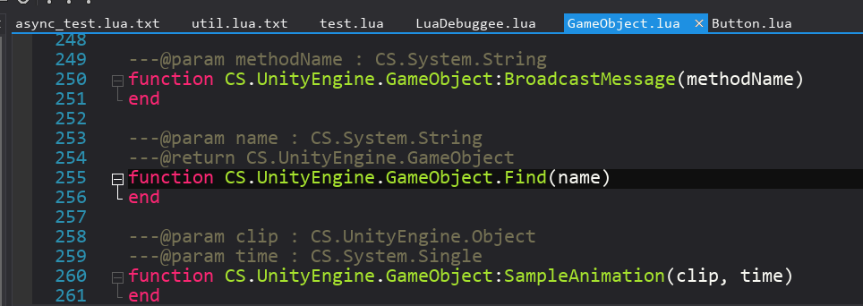

# LuaPerfect官方文档

## 概述

LuaPerfect是腾讯公司开发的专业级的Lua集成开发环境，致力于为广大Lua开发人员提供免费的专业的Lua调试工具。

LuaPerfect是一款基于纯C++实现的独立的Lua调试工具：  
1、接入方便：界面风格类似Visual Studio，符合VS用户习惯，非插件，接入自动化程度高，无需配置。  
2、调试功能强大：稳定的基础调试功能，强大的表达式监视，悬浮监视，日志跳转，条件断点，Lua异常捕获，Lua反汇编等功能。还可以直接查看C#对象的各种成员，在Unity下还能列出组件列表和子物体列表。  
3、调试性能高：调试密集Lua运算的游戏也不掉帧，因此特别适合调试游戏。  
4、编辑功能强大：支持语法/语义代码高亮，自动API生成，语法检查，单词/语句自动完成，按语义跳转符号，代码格式化，类型推导，类型注解，全工程符号搜索，按语义重构等功能。  
5、自带性能测试功能，测试密集Lua运算游戏的性能也不掉帧，因此结果更精确。  
6、资源占用少：相对脚本化插件化的方案(IDEA,VSCode等)，同等功能下内存等资源仅同类软件的一半左右。  
7、稳定流畅：运行稳定流畅，经过内部外部大型项目重度使用验证，得到非常高评价。  

以下为软件运行截图，图中为调试SLua密集Lua运算的性能测试例子circle.txt，截图显示调试时仍保持59帧未掉帧：

### 演示视频
演示视频([http://134.175.92.147/LuaPerfectVideo.zip](http://134.175.92.147/LuaPerfectVideo.zip))下载

### 软件下载

#### 官方QQ群下载
LuaPerfect官方群([932801740](https://jq.qq.com/?_wv=1027&k=54bnLYF))下载(速度快，推荐)

#### GitHub下载
LuaPerfect GitHub仓库([https://github.com/jiangzheng1986/LuaPerfect](https://github.com/jiangzheng1986/LuaPerfect))下载

#### 腾讯云下载
腾讯云([http://134.175.92.147/Versions/LuaPerfect_V1.026.zip](http://134.175.92.147/Versions/LuaPerfect_V1.026.zip))下载

## 工程

### 创建工程

需要在LuaPerfect中创建工程，才能开始编辑和调试。

通常而言，LuaPerfect能自动识别系统中的Unity及Unreal工程。但是未被Unity/Unreal打开过的工程需要手动打开一下。另外，判断Unity工程的条件是Plugins目录下的xlua.dll/slua.dll/tolua.dll/ulua.dll等。

对于Cocos/Quick工程或者其他的exe的工程，需要手动定位到执行的exe的文件。

> 问：我的Plugins目录不在Assets根目录下，提示我这不是一个XLua/SLua/ToLua/ULua工程，怎么办？

> 答：需要在Data/Config/PluginsFolders.lpxml里添加Plugins查找路径。

> 问：我的工程是XLua工程，但是dll的名字不是xlua.dll，是自己定义的名字，提示不是XLua工程无法打开，怎么办？

> 答：暂时请联系Anders帮忙添加，SLua/ToLua/ULua类似。

### 添加Lua目录

对于大型工程，游戏里的资源文件以十万计，LuaPerfect默认会打开 Assets文件夹。但是在Project视图里直接指定Lua目录是一种更为高效的做法。可以在Project界面的LuaFolders项点击右键添加Lua目录，添加完自己的Lua目录之后就可以从工程中移除Assets目录了(移除的意思是选中Assets目录，右键菜单选择Close Source Folder)。也可以直接在资源管理器中将需要添加的目录拖动至Project界面。

> 问：我的资源文件数量非常多，切换时会稍微有卡顿的感觉，怎么处理？

> 答：如果资源文件数量非常多，建议用File-Open Source Folder...只打开Lua脚本文件夹，然后关闭掉Assets文件夹。重新启动后会自动添加Apis目录。

> 问：我要如何打开我的Lua代码？我的Lua代码都在Asset Bundle包中，不在Assets中，可以打开吗？

> 答：你可以先打开Lua代码对应的工程，如果是Unity工程，LuaPerfect会自动打开Assets目录。如果Lua代码不在Assets中，可以直接在文件浏览器中将Lua代码文件夹拖入LuaPerfect的Project界面打开。或者可以用File-Open Source Folder...菜单项打开。

## 调试

### 调试原理

LuaPerfect的调试原理是通过在游戏中通过require("LuaDebuggee")来加载LuaDebuggee.dll，并通过 LuaDebugee模块设置调试钩子，从而完成调试的功能。如下图所示：

需要注意的是require("LuaDebuggee")操作引用的是LuaDebuggee.dll而不是LuaDebuggee.lua（因为为了优化调试性能，LuaPerfect使用了C++开发调试钩子）。在LuaPerfect工程列表里选择打开项目的同时，LuaPerfect会自动地将LuaDebuggee.dll复制到工程的目录（在Unity里一般是复制到Unity工程的目录，即Asset目录的父目录），以供游戏中调用。LuaDebuggee.dll是不需要手动复制的。 

### 调试步骤

对于Unity/Unreal，大多数情况下，按如下两步即可正常调试：

+ 步骤1：在工程入口点的 Lua 文件的开头，使用Debug-Paste StartDebug()菜单粘贴如下代码：

菜单")

+ 步骤2：在刚刚添加的语句后面执行的语句处放置一个断点（快捷键F9）。

+ 步骤3：对于Cocos/Quick或者其他exe的工程，如果需要指定命令行参数，可以在Options-Debug Parameters菜单项弹出的对话框中进行指定：

+ 步骤4：对于Unity/Unreal，在编辑器里启动游戏：

对于Cocos/Quick或者其他exe的工程，直接在LuaPerfect里执行Debug-Start Debugging菜单项（快捷键F5）。也可以直接在如下的调试工具栏中点击启动：

当代码执行完LuaDebuggee.StartDebug()之后，执行到放置的断点处时，即可触发放置的断点，如下图所示：

如果遇到无法正常触发断点，请根据输出的情况，参考如下的检查表进行判断/处理。

### 无法正常调试检查表

如果按这些步骤都无法正常调试，请根据打印的字符串进行相应的检查：

+ 一、对于没有任何LuaPerfect相关输出的情况，请确认以下可能原因：
	+ 1、请确认粘贴的StartDebug()代码有没有被执行。
+ 二、游戏中输出了'LuaPerfect: Failed to connect debugger!'的情况，请确认以下可能原因：
	+ 1、请检查StartDebug()里的调试器的IP和端口号是否正确。
	+ 2、或者请确认防火墙是否阻止了LuaPerfect内的调试器会创建TCP服务端口。可以将LuaPerfect移动磁盘位置重新打开。
+ 三、游戏中输出了'LuaPerfect: Check documents at: https://luaperfect.net'，请确认一下可能原因：
	+ 1、请参考**特别说明1**中的内容，确认是否是自定义Loader导致LuaDebuggee.dll模块被当成LuaDebuggee.lua文件加载。从而加载失败的问题。
+ 四、游戏或者LuaPerfect中输出了'LuaPerfect: Successfully connected to debugger!'，LuaPerfect的窗口边框变成橙色，但是还是无法断点的情况，请确认以下可能的原因：
	+ 1、在StartDebug()调用之前的地方放置的断点不会触发，请务必在StartDebug()调用之后的地方设置断点。
	+ 2、请开启**Options-Debuggee-Debug Mode**菜单项，开启后调试时LuaPerfect将在输出框输出原始字符串及LuaPerfect尝试转换的结果，开启后将会非常方便问题排查。
	+ 3、如果输出的原始字符串都是Lua源代码而不是有效的Lua文件名称或者路径。请参考**特别说明2**中的内容，确保将Lua文件的路径传递给调试核心。
	+ 4、同样路径及名字的文件，请不要同时加载两份到Project视图的LuaFolders目录。建议仅加载用于编辑的Lua脚本目录，复制目录或者字节码目录不建议添加到LuaFolders里。
	+ 5、由于XLua官方示例工程中很多地方使用DoString()，建议使用自带的00_LuaPerfectTest_XLua这个例子进行测试，自带的例子在官方群00_LuaPerfectTest_XLua.zip中。其它解决方案类似。
+ 五、**如果出现其他问题，或者上述描述不够清楚，请到LuaPerfect官方群([932801740](https://jq.qq.com/?_wv=1027&k=54bnLYF))中进行咨询或反馈，谢谢**。

#### 特别说明1 - 自定义loader加载LuaDebuggee模块报错的问题

加入require("LuaDebuggee").StartDebug("127.0.0.1", 9826)后，LuaPerfect没有任何反应（边框没有变黄），自定义的Lua文件Loader里发生错误，提示找不到LuaDebuggee.lua或者类似的提示（有时直接提示"LuaPerfect: Check documents at: https://luaperfect.net"）。

对于XLua，需要修改LoadFromCustomLoaders，针对"LuaDebuggee"的情况，直接返回0，如下图所示：

对于SLua，需要修改LuaState.cs中的loader()，对于"LuaDebuggee"的情况，压入true和nil并返回2。如下图所示：

对于ToLua，需要修改ToLua.cs文件中的Loader()函数，针对"LuaDebuggee"的情况，直接返回0，如下图所示：

#### 特别说明2 - luaL_loadbuffer()未传递有效name的问题

某个代码是否可以调试基本上依赖于实际执行luaL_loadbuffer()时传递给lua的name参数。如果调试器有可能从该字符串猜到对应的是项目中的哪个文件的话，就可以调试该文件。所以可以C#里断点看这个name。这个name通常建议传’@’ + 绝对路径，通常是没有问题的。可以开启Options-Debuggee-Debug Mode，查看转换前和转换后的文件名。

对于XLua，可以在DoString()时，对name变量传递’@’ + 绝对路径。其他Lua解决方案也可以类似解决。

#### 其他说明

> 问：我要去哪下载调试核心LuaDebuggee.dll？

> 答：LuaDebuggee.dll会由LuaPerfect工具自动复制到可以被加载到的地方，直接就可以require()，无需手动下载/复制，对于Unity，是Assets同级目录即Unity工程目录。

> 问：为什么我的项目中有的文件可以调试，有的问题不可以调试？

> 答：请参考**特别说明2**

> 问：为什么我关闭Unity里的游戏之后，调试器仍显示在调试状态中？

> 答：需要在Unity关闭游戏的处理里（例如onDestroy函数中）调用require(“LuaDebuggee”).Stop()。参考各例子工程。

> 问：为什么我的某些工程里，有时会出现连接不上调试器的情况？

> 答：请尝试在Unity关闭游戏的处理里（例如onDestroy函数中）调用require(“LuaDebuggee”).Stop()。参考各例子工程。

### 直接查看Unity对象成员

LuaPerfect 除了提供查看常规的 Lua 值/对象的能力，也提供了查看 Unity 里的 C#对象成员的 能力，并且更进一步，如果查看的对象是 GameObject 对象，会列出其各个子 GameObject 对 象 及 GameComponent 对 象 。 因 此 XLua 和 SLua ， 需 要 Make 一 下 ， 确 保 ThirdParty/LuaPerfect/ObjectFormater.cs 被正常导出到 Lua。在 ObjectForamter 类被正常导出 到 Lua 之后，LuaPerfect 中即可正常查看 Unity 里的 C#对象。

### 输出日志到调试器

LuaDebuggee.dll中有日志输出的接口：

**双击输出的日志，可以定位到输出日志的行**。如果对日志输出函数进行了封装，可以在Data/Config/PrintFunctions.lpxml中添加自己的输出函数的名字，从而可以在调试时让调试器继续往上查找堆栈，从而在输出时能正常定位到日志输出位置。

## 性能测试

1、启动性能测试 将 StartDebug 替换成 StartProfile，即可在游戏中开始性能测试。亦可以在调试状态下，执行 Profile->Start Profiling 菜单项开始性能测试。 

2、结束性能测试 调用 require("LuaDebuggee").Stop()即可结束性能测试，并显示性能测试结果。亦可在编辑器 里执行 Profile->Stop Profiling 菜单项结束性能测试，并显示性能测试结果。

## 编辑

### Unity的Lua版本API生成

LuaPerfect拥有强大的类型推导引擎，但是也仍然需要类型信息库才能很好地工作。可以在Unity主菜单->LuaPerfect->Generate XXX Apis 按需生成自己版本的Unity Lua API文件。生成的API文件通常在 Assets/lpproj/Apis/Unity/中。生成完API之后，LuaPerfect即可根据API文件对类型进行提示，从而提高编码效率。

### 一、注解(Annotation)

### 二、快捷键列表

## 配置

### 一、自定义配色及快捷键

### 二、自定义字体

## 实用小技巧

LuaPerfect 里有许多隐藏的小技巧，下面列出一些实用的小技巧： 
1、双击输出的 log，可以直接跳转输出该 log 的 Lua 代码。
2、可以通过右键菜单->Paste StartDebug()快速粘贴此段代码。 
3、在各变量窗口里，双击 Lua 函数节点，可以查看该 Lua 函数的反汇编。 
4、Intelligence->Check Syntax(F7)可以快速检查工程中的语法错误。 
5、Intelligence->Go To File(Ctrl+P)可以快速定位到某个特定文件。 
6、Intelligence->Go To Symbol(Ctrl+R)可以在文件里快速定位到某个特定函数/变量。 
7、Intelligence->Go To Symbol In Project(Ctrl+Shift+R)可以在整个工程里快速定位到某个特定 函数/变量。 
8、按住 Ctrl 滚动鼠标滚轮可以调整代码字体大小。 
9、各种窗口及选项卡均可以拖放。 
10、主菜单 Options->Track Alive 可以开启/关闭工程界面追踪点击的文件的功能。
更多惊喜等你来发现&创造。

## 隐私陈述

为确认版本质量，在联机环境下，Lua Perfect 会对启动/关闭/转储等基础事件进行统计，但 不会尝试获取其他任何数据。有需要关闭统计的，可以在 Data/Config/EditorConfig.lpxml 中 SendStatistics 项进行设置。

### 贡献墙
感谢你们的支持、反馈和贡献：john，siney，topameng，ares，ce，mony，ansen，fidel，cooper，saul，vader，walle，william，tock，glad，yule，天地一MADAO，Jay，Wisdom，未曾，timmy，flash，克克狼，★Smartly☆，frank，qigao，Ray，ud，有你好看，ShaopingCui，Von Neamann，夜，♥ Virgo丶，...，马劲松，轩，SoMe，随意鸥，Anyq，市井 '，扣扣小妖，kenny，1023094781，心梦无痕，长弓海，ike，天涯，3°，kramer，大魔王有木桑，ZeaLotSean(官网框架)，HHH，HIQ，hop，Я7(R7 Theme代码配色配置)，墟烟，dll，johnd，古月良云，起跑线To，肉松可爱多，ZensYue，小二郎，joary，呵呵哒，ccgo，风哥，Mr.菟，成都-大红花，1564179138，eagle，白客，酒弎，淡然

### 更新说明

#### 2019.09.16，版本1.026：
1、配置字体的功能(Data/Config/EditorConfig.lpxml-EnglishFontFilename&ChineseFontFilename)(感谢白客反馈)
2、批量格式化的功能(Intelligence-Tools-Format All Lua Files...)(感谢呵呵哒,ZeaLotSean反馈)
3、LuaDebuggee.Stop()时把调试/性能测试钩子取消掉(感谢Jay反馈)
4、格式化时空白字符行格式化为空行的功能(感谢Я7反馈)
5、格式化时消除行尾空白字符的功能(感谢Я7反馈)
6、最新版print报错(感谢酒弎反馈，1.025_1版本)
7、修复正常输入时会dmp的问题(感谢淡然反馈，1.025_1版本)

#### 2019.09.09，版本1.025：
1、修复基类的方法不能自动补全的问题(无论是否self)(感谢Mr.菟，成都-大红花反馈)
2、变量监视时Lua表格的成员列表按字母顺序进行排序(感谢Jay反馈)
3、修复ObjectFormater.cs中obj没有判断空的问题(感谢Jay反馈)
4、新增正则表达式辅助下拉菜单(感谢天涯，风哥反馈)
5、修复print时Unity里会输出一长串源代码，然后才输出要输出的内容的问题(感谢1564179138，eagle反馈)
6、修改LuaDebuggee提示文本，去掉Something happend的表述(感谢ares反馈)
7、Paste StartDebug()粘贴的文本中加入连接不成功时的输出和连接成功时的输出(感谢Jay，eagle反馈)
8、新增Options-Skip Synchronizing LuaDebuggee.dll选项(感谢Jay反馈)
9、修改Options-Skip Synchronizing Code选项为Options-Skip Synchronizing CSharp-Code选项，影响范围改为单个工程(之前启用过的需要重新增对工程再启动一次)
10、修复Pandora下提示failed to load lua dll/pdb的问题(感谢kenny反馈)

#### 2019.09.01，版本1.024：
1、支持正则表达式(感谢天涯，风哥反馈)
2、修复某些情况下不同目录下的同名文件其中一个无法断点的问题(感谢Ray反馈)
3、标题栏带绝对路径,方便区分同一个项目的不同分支(感谢ZensYue反馈)
4、增加Options-Default Lua Extension菜单
5、调整工程列表界面
6、调整工程视图右键菜单顺序(感谢Я7反馈)
7、修复了Translate Tabs To Spaces相关的4个问题(感谢Я7反馈)
8、修复了指定查找CurrentFile无效的问题
9、修复了CurrentFile选项会变成CurrentProject的问题

#### 2019.08.25，版本1.023：
1、修复输入法不跟随光标的问题(感谢古月良云，ccgo，Я7反馈)
2、支持连续的快捷键，比如Ctrl+K,C(感谢Я7反馈)
3、缩进都是用的\t，能不能搞个配置用4个空格代替(感谢Я7反馈)
4、修复了LuaDebuggee.dll有些情况下崩溃的问题(感谢hop，天涯，Я7反馈)
5、修复Cocos调试时的bug，支持Cocos调试!（感谢HHH，Ray，3°反馈）
6、新增被调试程序命令行参数可配置
7、修复pdb加载缓慢的问题（感谢Ray反馈）

#### 2019.08.19，版本1.022：
1、Theme中增加自定义快捷键支持(Key的取值: A-Z 0-9 F1-F12 [ ] / . - = ; \ ' , 以及Left,Right,Up,Down,PageUp,PageDown,Home,End,Backspace,Delete,Tab,Enter,Break,Escape)(感谢ares，glad，肉松可爱多，ZensYue，hop反馈)
2、增加Options-Edit Theme Mode,用于快速自动预览Theme
3、Lua文件模板(Data/Config/Template.lua),支持Date,Time,FileName,ProjectName等标签(感谢小二郎，古月良云，joary反馈)
4、提供一个菜单打开配置文件夹:Options-Open Config Directory
5、支持配置是否自动拷贝ObjectFormater.cs文件的菜单(Options-Skip Synchronizing Code)(感谢hop反馈)
6、调整Project视图右键菜单顺序，Find In Folder放第一位(感谢呵呵哒反馈)
7、Project视图LuaFolders增加Find In Project菜单项(感谢呵呵哒反馈)
8、代码菜单右键菜单增加Find In Folder菜单项(感谢呵呵哒反馈)
9、Find In Foler增加Ctrl+F3的快捷键(感谢呵呵哒反馈)

#### 2019.08.11，版本1.021：
1、修复单行过长时会导致崩溃的问题。（感谢HIQ反馈）
2、xlua.dll为特定名称时的调试支持。（感谢hop反馈）
3、函数里的局部变量被赋值成员，不再被识别为类。（感谢hop反馈）
4、修复重新加载Theme时没有重建里面的某些颜色表的问题。（感谢Я7反馈）
5、修复ToLua执行print()会报错的问题。（感谢墟烟反馈）
6、智能提示新增按tab来完成。（感谢dll，hop，johnd反馈）
7、修复修改时会自动展开所有折叠的问题。(感谢扣扣小妖反馈)
8、修复子函数里的括号开始和结束的标志在全部折叠时不会消失的问题。
9、自定义背景图片(Data/Config/Background.png)。(感谢古月良云反馈)
10、Я7提供了R7 Theme代码配色配置。(感谢Я7提供配置)(建议用新版本加载配置)
11、日志的功能，能否允许跳转往上一级的，希望可以自定义向上跳过的函数名列表。(感谢frank，起跑线To，hop反馈)

#### 2019.07.21，版本1.020：
1、新增有pdb情况下，lua是静态库的时候的调试。（感谢HHH，3°反馈）

#### 2019.07.16，版本1.019：
1、Ctrl+鼠标滚动时字体大小的步长从2修改为1。（感谢大魔王有木桑反馈）

#### 2019.07.13，版本1.018：
1、修复Cocos在General模式下提示Project not matched的bug。（感谢3°反馈）
2、整合General模式和Cocos/Quick模式。（感谢3°反馈）
3、修复Pandora在General模式下提示Project not matched的bug。（感谢kramer反馈）
4、在尝试用General模式打开Unity.exe或者UE4XXX.exe时进行错误提示。
5、修改工具内官网链接地址。
6、修改版本号升级规则(如不再以1.18.0之类命名，而直接使用1.018命名)。

#### 2019.04.21，版本1.17.0：
1、增加ProjectFilename,CodeFilename及LineNumber命令行参数，用于在命令行直接打开工程/文件。(感谢天涯反馈)
2、---@field注解允许不带类型。(感谢天涯反馈)
3、EditorConfig.lpxml增加SkipSynchronizingCode属性，用于控制是否复制各种C#文件到工程。(感谢frank,ares反馈)
4、ApiGenerator.cs中部分函数改成public,方便定义具体项目自己的ApiGenerator。(感谢ares反馈)
5、修复streamWriter的Close()放入finally块。(感谢frank反馈)

#### 2019.04.08，版本1.16.3：
1、Windows下打包，LuaDebuggeeLoader.cs会导致提示找不到LuaDebuggee.dll，暂时删除LuaDebuggeeLoader.cs。(感谢扣扣小妖反馈)
2、修改Paste StartDebug()的内容，加入查看faq的提示。(感谢ike反馈)
3、修复General模式下,无法正常复制LuaDebuggee.dll的问题。（感谢马劲松反馈）
4、新增测试General模式的测试用例。（感谢马劲松反馈）

#### 2019.04.03，版本1.16.2：
1、修复了Unity 4.x下32位Unity.exe复制64位LuaDebuggee.dll的问题。（感谢frank反馈）

#### 2019.04.02，版本1.16.1：
1、修复了监视长度超过1000的字符串会出现缓冲区溢出导致Unity挂掉的问题。（感谢kenny,马劲松反馈）

#### 2019.04.01，版本1.16.0：
1、兼容EmmyLua的注解的写法。（感谢Ray,天涯反馈）
2、LuaDebuggee.dl崩溃时保存Dump到Unity.exe同级Data/Dump目录。（感谢kenny,马劲松反馈）
3、优化try-catch的性能，并优化Dump后的行为，尽量不导致Unity关闭。（感谢kenny,马劲松反馈）
4、修复先输入一个很长的字符串，然后选中一个短的字符串，按Ctrl+F不显示的问题。（感谢夜反馈）
5、修复保存操作会导致显示函数签名提示的问题。
6、修复保存操作会无法自动关闭函数签名提示的问题。
7、整合Ctrl+P,Ctrl+Shift+P,Ctrl+Alt+P，增加页签。（SoMe反馈）

#### 2019.03.25，版本1.15.0：
1、处理Pandora里dll要用pua_luaopen开头的问题。（感谢kennyge反馈）
2、修改自动完成的for k, v in ipairs(t)为for i, v in ipairs(t)。(感谢心梦无痕反馈)
3、不是默认端口号时增加一个输出提示。（感谢马劲松反馈）
4、处理Pandora里C#对象查看的问题。（感谢kennyge反馈）
5、修复非exe目录启动时会报shader错误的问题。(感谢...反馈)
6、修复.Lua.txt在有词法错误的情况下加载时无法显示语法高亮的问题。(感谢长弓海反馈)
7、询问界面仍然提示"Remove Source Folder"的问题。(感谢...反馈)
8、Remove Folder改为Delete Folder。(感谢...反馈)
9、只有开启调试核心的调试模式才创建Data/Log/Debuggee.log。
10、修改右键菜单弹出位置的规则。
11、修改配色和图标。
12、修复General模式启动调试时不保存文件的问题。
13、修改Ctrl+P界面评分算法，平衡长度和连续度。(感谢马劲松反馈)

#### 2019.03.19，版本1.14.1：
1、Resources和AB包里都有lua文件的情况导致无法断点的问题。(感谢...,未曾反馈)
2、修复Assets文件夹被忽略导致无法断点的问题。(感谢1023094781和...反馈)
3、修复General无法调试的问题。
4、接管调试把sethook函数替换掉后，主动报错改成仅打印提示。（感谢马劲松反馈）

#### 2019.03.18，版本1.14.0：
1、Add Source Folder改成Open Source Folder，Remove Source Folder改成Close Source Folder。(感谢市井 '，扣扣小妖，随意鸥反馈)
2、修复常规输入框里文本颜色变成紫色的问题。
3、安装到某些文件夹中无法写入的文件时进行提示。(感谢kenny反馈)
4、默认也打开.lua.bytes后缀的lua文件。(感谢kenny反馈)
5、Paste StartDebug()菜单改成粘贴会判断加载成功的代码。(感谢ud反馈)
6、整理一下dll被占用时的提示的交互。(感谢随意鸥反馈)
7、修复切换程序时非客户区有白色边框的问题。
8、提供Options-Default File Format和Options-Default Line Ending。(感谢克克狼反馈)

#### 2019.03.14，版本1.13.7：
1、如果是浏览XLua工程目录的话，就全Assets搜索一下Plugins下面的xlua.dll。(感谢Anyq反馈)
2、接管调试后把sethook函数替换掉，改成仅打印提示的函数。（感谢马劲松反馈）

#### 2019.03.14，版本1.13.6：
1、修复调试时会报错attempt to index a nil value的问题。(感谢马劲松反馈)

#### 2019.03.12，版本1.13.5：
1、支持拖动到屏幕顶部最大化，支持最大化时拖动标题还原。(感谢马劲松反馈)
2、提供菜单直接配置哪些文件扩展名的文件需要显示在ProjectUI中/解析/检查。(感谢随意鸥反馈)

#### 2019.03.11，版本1.13.4：
1、重新编译，查Dump的问题。(感谢SoMe反馈)

#### 2019.03.11，版本1.13.3：
1、修复因Plugins目录位置不在根目录导致Projects are not matched的报错。(感谢马劲松反馈)

#### 2019.03.11，版本1.13.2：
1、访问__DebuggeeTempVar被用户代码拦截的问题，改为访问LUA_REGISTRYINDEX表(感谢轩反馈)
2、View-Switch File菜单加入Go To File菜单项。

#### 2019.03.11，版本1.13.1：
1、支持调试由dostring()执行但是文件本身就是存在且传递的是代码的情况(需要开启Options-Debuggee-Search Source In DoString)。(感谢夜，♥ Virgo丶反馈)

#### 2019.03.11，版本1.13.0：
1、直接在Options-Debuggee-Debug Mode菜单中开启调试器调试模式。(感谢未曾反馈)
2、Open Containing Folder改成Show In Explorer。(感谢未曾反馈)
3、代码颜色区分全局变量，局部变量和参数变量。(感谢...反馈)
4、新增查找Plugins目录列表(用于判断是否XLua等解决方案的工程)。(感谢马劲松反馈)

#### 2019.03.8，版本1.12.4：
1、改为通过在Plugins目录去搜索xlua.dll来判断是否XLua工程，其他解决方案同理。(感谢Von Neamann反馈)
2、修复命名是xx.xx.lua的文件在编辑器中就显示不出来的问题。(感谢夜，♥ Virgo丶反馈)

#### 2019.03.8，版本1.12.3：
1、类似VS里的Ctrl+Tab和Ctrl+Shift-Tab的Active Files界面。(感谢ShaopingCui反馈)

#### 2019.03.7，版本1.12.2：
1、文件夹层次过深时Track Active效果不好，暂时屏蔽默认开启Track Active。（感谢未曾反馈）

#### 2019.03.6，版本1.12.1：
1、增加常见问题FAQ文档。（感谢ud反馈）
2、代码格式化快捷键从F8修改为F8或Alt+Shift+F。(感谢有你好看反馈)
3、由于调试按钮上绑定调试帮助的功能会影响调试体验，取消此引导方法。(感谢tock反馈)

#### 2019.03.4，版本1.12.0：
1、支持多键鼠标的后退/前进键。(感谢ares,flash反馈)
2、函数调用也用特定颜色标记。(感谢flash,anson反馈)
3、File菜单增加Add Source Folder菜单项。
4、不是焦点时不显示括号对,不是Lua文件不显示括号对,两个括号在一起的情况，只显示一个大的。
5、提供LuaDebuggeeLoader.cs加载LuaDebuggee.dll的方法。(感谢未曾反馈)
6、复制cs文件时根据优先列表进行配置Data/Config/CandidateFolders.lpxml复制到指定目录(感谢Jay,ares反馈)
7、支持ULua调试。(感谢frank反馈)
8、支持ULua-查看C#对象。(感谢frank反馈)
9、处理Cocos 3.13无法调试的问题。(感谢Ray反馈)
10、使用代理打印函数处理调试tolua需要修改源码的问题。
11、优化并统一调试路径匹配算法。
12、修复调试菜单全部是灰色会导致用户误以为无法调试的问题！(感谢qigao反馈)
13、支持任意使用Lua的dll的exe的Lua调试(General调试)。(感谢Ray反馈)
14、默认开启Track Active Documents。(感谢未曾反馈)
15、提高与选中符号相同的符号的颜色的对比度。(感谢flash反馈)
16、文件一片白色,最好能上色的都上色。(感谢flash,未曾反馈)
17、光标去哪就选中所在符号。
18、查找时没有实时的黄色框显示。(感谢未曾反馈)
19、成员字段的显示换一种颜色。(感谢未曾反馈)
20、自定义代码颜色主题。(感谢yule反馈)

#### 2019.02.24，版本1.11.0：
1、粘贴代码时自动缩进的功能。（感谢ares,flash,克克狼反馈）
2、代码自动格式化的功能。（感谢ares,flash,克克狼反馈）
3、修复从智能提示中选中时，强制替换了之后的一项的问题。（感谢ares,flash反馈）
4、新增显示匹配的括号对的功能。（感谢ares,flash反馈）
5、修复换行后Tab数量不对的问题。（感谢ce反馈）
6、从智能提示中选中时，强制替换了之后的一项。（感谢ares,flash反馈）
7、选中的情况下输入"([{，在选中的字符串两边加上"",(),[],{}。
8、排查没有显卡驱动时黑屏的问题，增加没有驱动时的提示。（感谢未曾反馈）
9、修复某些机器上使用OpenGLES驱动导致长时间运行会变慢/崩溃的问题。（感谢ares反馈）
10、修复某些机器上使用OpenGLES驱动导致启动时崩溃的问题。（感谢★Smartly☆反馈）

#### 2019.02.15，版本1.10.0：
1、增加ToLua支持。（感谢timmy反馈）
2、注释操作同时支持Ctrl+-和Ctrl+/快捷键。（感谢ares反馈）

#### 2019.02.15，版本1.9.5：
1、修复生成的api里有与最终lua同名的情况下断点失败的问题。

#### 2019.02.14，版本1.9.4：
1、修复新版本特定情况下项目无法调试的问题。（感谢tock反馈）
2、保守处理某些情况下窗口配置文件Width=1,Height=1的情况。（感谢ares反馈）
3、修复ApiGenerator.cs中处理无命名空间的类时会生成有Lua错误的代码的问题。

#### 2019.02.13，版本1.9.3：
1、修复一个CodeInfo为空指针导致崩溃的问题。（感谢Jay反馈）
2、ApiGenerate类整合Clear操作到生成操作内。
3、ApiGenerate类处理类名时处理操作更通用。

#### 2019.02.12，版本1.9.2：
1、修改为.lpproj时兼容旧的工程文件/用户配置文件。

#### 2019.02.12，版本1.9.1：
1、通过修改为.lpproj,修复lpproj文件夹会被打包进去最终包里的问题。（感谢Jay,ares,walle反馈）
2、通过修改为.lpproj,修复lpproj文件夹中小文件会在Unity中进行刷新的问题。（感谢Jay,ares,walle反馈）
3、ApiGenerator.cs改为复制到ThirdParty/LuaPerfect/Editor中。（感谢Jay,ares,walle反馈）
4、lpproj/Apis/里的.lua代码无论如何不应该被过滤掉。（感谢Jay反馈）
5、修复Api生成时会生成类似CS__StaticArrayInitTypeSize=24这样的类名的问题。（感谢Jay反馈）

#### 2019.02.11，版本1.9.0：
新增功能:
1、新的文件查找/替换界面。
2、if,ifelse,ifelseif,repeat,while,for,fori,forp,do,returnm,function等自动补全语句。(感谢ce反馈)
3、".if",".ifelse",".ifelseif",".repeat",".while",".for",".fori",".forp","return",".function"等后缀自动补全。(感谢ce反馈)
4、() {} [] '' ""五种符号都可以成对，然后光标定位在中间。(感谢ce反馈)
5、修改对话框，使得可以在窗口内拖动。(感谢glad反馈)
6、通过状态栏显示Parsing...来表示当前正在执行解析操作。
7、支持直接拖文件夹到ProjectUI。
8、拖工程里有的文件到ProjectUI，则直接打开该文件。
新增菜单:
1、新增切换上一个下一个函数的菜单功能(快捷键Alt+Up,Alt+Down)。
2、选中单词的菜单功能(快捷键Ctrl+W)。
3、选中整行的菜单功能(快捷键Ctrl+L)。(感谢ce反馈)
4、复制当前选中或当前行的菜单功能(快捷键Ctrl+D)。
5、删除当前行的菜单功能(快捷键Ctrl+K)。
6、增加Options-Fonts-Largr/Smaller/Reset菜单。
快捷键修改:
1、前向和后向导航快捷键修改为Alt+Left及Alt+Right。
2、注释/取消注释快捷键修改成Ctrl+-。
3、Go To Symbol In File的快捷键改为Ctrl+Shift+P。
4、Go To Symbol In Project的快捷键改为Ctrl+Alt+P。
Bug修复:
1、修复SLua里下了断点的情况下StepOver也在原始行断点的问题。
2、修复调试状态时无法刷新文件的问题。(感谢ares反馈)
3、修复启动时就直接注释会出问题的问题。

#### 2019.02.01，版本1.8.1：
1、修复02_U3DScripting无法调试的问题。(感谢未曾反馈)
2、增加00_LuaPerfectTest的XLua测试例子。
3、主菜单调试菜单增加调试说明菜单项。

#### 2019.01.31，版本1.8.0：
1、修复双屏下副屏中最大化会消失的问题。(感谢Wisdom反馈)
2、在文档里标明一下XLua的例子只有07_AsyncTest适合调试。(感谢未曾反馈)
3、修复StartProfile时无法启动Profile的问题。(感谢未曾反馈)
4、优化StopProfiling时卡住的问题，修改为异步等待调试钩子结果返回。(感谢Wisdom，未曾反馈)
5、在StopProfiliing之后输出提示信息，提示用户触发lua操作。(感谢未曾反馈)

#### 2019.01.30，版本1.7.3：
1、修复无法正常检测某些版本的XLua工程的问题。(感谢Jay反馈)
2、修复任务栏在左边和上边时最大化时显示有问题的问题。(感谢Jay反馈)
3、优化txt和bytes文件是否是lua文件的判断策略。(感谢Jay反馈)
4、修复有module("xxx", package.seeall)语句的文件无法下断点。(周林ansen反馈)
5、优化LuaDebugee.dll被占用无法复制时的提示。

#### 2019.01.28，版本1.7.2：
1、修复如果传递给xluaL_loadbuffer的文件名字符串是原始require()的字符串时调试不了的问题。(感谢天地一MADAO反馈)

#### 2019.01.27，版本1.7.1：
1、修复断点列表在文件关闭后内不显示的问题。(感谢天地一MADAO反馈)

#### 2019.01.21，版本1.7.0：
1、增加类似Sublime里面Ctrl+R智能查找当前文件函数列表的功能。(感谢ce反馈)
2、增加类似Sublime里面Ctrl+Shift+R智能查找当前工程函数列表的功能。(感谢ce反馈)
3、修复代码编辑时Shift+Tab与预期不符的问题。(感谢ce反馈)
4、修复编辑器里双击中文字符串崩溃的问题。(感谢yule反馈)
5、修复调试时被Lua保存一些调试时监视到的C#对象导致切换场景时被工具检测为内存泄漏的问题。(感谢ares反馈)
6、全部文档整合为一份。(感谢ce反馈)

#### 2019.01.21，版本1.6.1：
1、优化调试器匹配Lua文件的算法,增强算法适应性。(感谢glad反馈)

#### 2019.01.18，版本1.6.0：
1、修改目录结构，精简大小，且更容易找到执行档。
2、优化自动更新程序，优化为增量更新。
3、支持笔记本触摸板左右滑动事件。
4、优化工程列表菜单为工程列表界面。

#### 2019.01.11，版本1.5.1：
1、修复读取txt文件会崩溃的问题。(感谢tock反馈)
2、修复某些写法的LuaLoader下无法调试的问题。(感谢tock反馈)
3、优化Lua api的生成。(感谢tock反馈)

#### 2019.01.09，版本1.5.0：
1、修复键盘上下移动后再注释时注释错误的行的问题。(感谢ares反馈)
2、把启动时故意停下来的代码去掉。(感谢walle、ares反馈)
3、查看性能测试数据时可以选择按代码顺序排序或者耗时排序。(感谢ares反馈)
4、增加工程树形视图项跟随代码选项卡的激活而改变的TrackActive功能。(感谢walle反馈)
5、修复自动更新失败导致屏蔽主程序启动的问题。(感谢ce反馈)
6、修复添加了Assets内的Lua文件夹的工程断点失败的问题。(感谢ce反馈)
7、整理了判断是否Lua文件的判断逻辑，新增识别bytes类型Lua文件。(感谢tock反馈)
8、优化性能测试功能的交互，可以直接在编辑器中启动Profile/停止Profile。(感谢ares反馈)
9、修复点击创建新文件后，焦点不在被创建文件的Edit上的问题。

#### 2019.01.08，版本1.4.3：
1、修改XLua调试文档，提示需要主动Generate Code。(感谢ares反馈)
2、在XLua下判断到未导出的情况下主动提示Generate Code。(感谢ares反馈)
3、将ObjectFormater.cs从lpproj目录移动至ThirdParty/LuaPerfect目录。(感谢ares反馈)
4、修复ObjectFormater.cs里字符串格式化用了C++的%d的问题。(感谢ares反馈)

#### 2019.01.07，版本1.4.2：
1、支持在工程视图右键菜单中直接新增额外的Lua源代码目录。(感谢ares反馈)
2、支持直接浏览指定XLua工程目录。(感谢ares反馈)

#### 2019.01.04，版本1.4.1：
1、对接入流程中的提示进行修改。（感谢walle反馈）

#### 2019.01.02，版本1.4.0：
1、新增显示函数签名功能。
2、大幅度增强智能提示功能。

#### 2018.12.28，版本1.3.1：
1、消除泛型原型导致GetComponent()推导失败的问题。
2、LuaDebuggee自身增加注解。

#### 2018.12.21，版本 1.3.0：
1、大幅度增强F12跳转定义功能。
2、修复module()定义的模块中无法下断点的问题。(感谢ansen反馈)
3、修复下了断点的文件被删除，重新启动时崩溃的问题。

#### 2018.12.19，版本 1.2.2：
1、提供可配置筛选哪些文件。(感谢ansen反馈)
2、智能查找界面里对特定后缀名文件的过滤。(感谢ansen反馈)
3、自动打开上次打开的工程。

#### 2018.12.18，版本 1.2.1：
1、Unreal及Cocos工程增加打开文件对话框方式打开工程。(感谢vader反馈)

#### 2018.12.14，版本 1.2.0：
1、实现在Unity内监视C#对象的功能。
2、实现在Unity内可导出lua api。(感谢john反馈)

#### 2018.12.05，版本 1.1.0：
1、优化系统在大规模项目中的性能。(感谢ansen反馈)

#### 2018.11.14，版本 1.0.0：
1、首次正式发布。

## 反馈&联系方式

感谢您使用 LuaPerfect，在使用中如果遇到任何问题，或者有任何意见建议，请您立刻马上
通过以下方式联系我们：

+ QQ群: LuaPerfect官方群([932801740](https://jq.qq.com/?_wv=1027&k=54bnLYF))

+ Author: Anders (672250695@qq.com)

+ Director: Young

欢迎加入LuaPerfect官方群([932801740](https://jq.qq.com/?_wv=1027&k=54bnLYF))了解最新的版本信息及问题解答，与我们一起打造您专属的 Lua 开发工具。