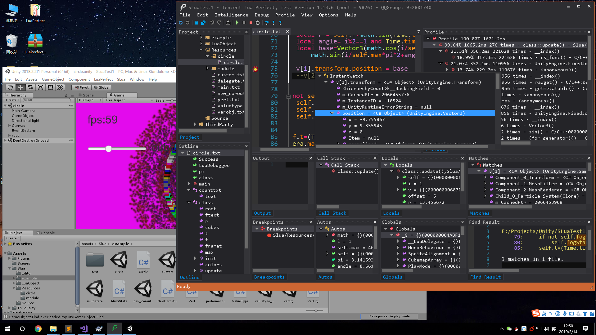

LuaPerfect
==========

概述
----
LuaPerfect是一款基于纯C++实现的独立的Lua编辑和调试工具：  
1、接入方便：界面风格类似Visual Studio，符合VS用户习惯，非插件，接入自动化程度高，无需配置。  
2、调试功能强大：稳定的基础调试功能，强大的表达式监视，悬浮监视，日志跳转，条件断点，Lua异常捕获，Lua反汇编等功能。还可以直接查看C#对象的各种成员，在Unity下还能列出组件列表和子物体列表。  
3、调试性能高：调试密集Lua运算的游戏也不掉帧，因此特别适合调试游戏。  
4、编辑功能强大：支持语法/语义代码高亮，自动API生成，语法检查，单词/语句自动完成，按语义跳转符号，代码格式化，类型推导，类型注解，全工程符号搜索，按语义重构等功能。  
5、自带性能测试功能，测试密集Lua运算游戏的性能也不掉帧，因此结果更精确。  
6、资源占用少：相对脚本化插件化的方案(IDEA,VSCode等)，同等功能下内存等资源仅同类软件的一半左右。  
7、稳定流畅：运行稳定流畅，经过内部外部大型项目重度使用验证，得到非常高评价。  

软件形态
--------
独立的PC端应用程序，非插件。解压即用，绿色环保，整个软件包非常精简，解压完仅4个文件，4.35M。自带自动更新，单次更新数据仅2M左右。

使用方式
--------
LuaPerfect会自动列出系统中已有的带Lua解决方案的Unity/Unreal工程。在入口点用菜单自动粘贴启动调试的一行代码即可调试，无需任何其他操作。 

使用截图
--------

联系我们
--------
Author:   Anders (672250695@qq.com)  
Director: Young
QQ群:     LuaPerfect官方群([932801740](https://jq.qq.com/?_wv=1027&k=54bnLYF))
官方网站: [https://luaperfect.net](https://luaperfect.net)